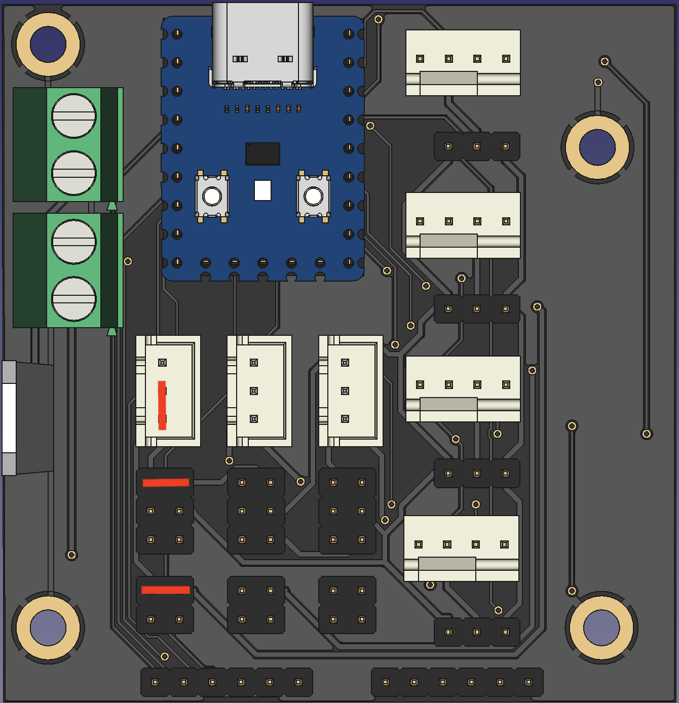
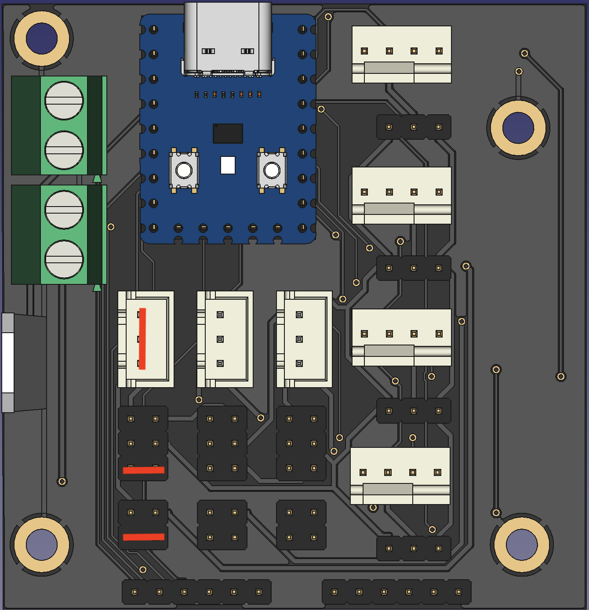
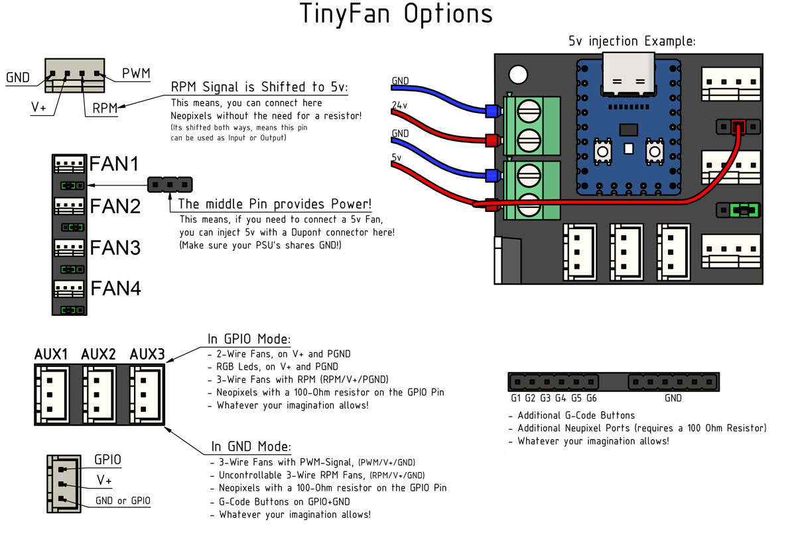

## Klipper:
 

<ul><li>

<h3><a href="./TinyFan.cfg">TinyFan Example Config</a></h>

</li></ul>

<ul><li>

<h3>Board Aliases:</h>

<pre>[mcu tinyfan] serial: /dev/serial/by-id/usb-Klipper_rp2040_XXXXXXXXXXXX restart_method: command  [board_pins tinyfan] mcu: tinyfan aliases: 	#FAN Ports: 	FAN1_PWM=gpio0, FAN1_RPM=gpio7, 	FAN2_PWM=gpio1, FAN2_RPM=gpio8, 	FAN3_PWM=gpio2, FAN3_RPM=gpio9, 	FAN4_PWM=gpio3, FAN4_RPM=gpio10, 	 	#AUX Ports: 	AUX1_PWM=gpio4, AUX1_RPM=gpio26, 	AUX2_PWM=gpio5, AUX2_RPM=gpio27, 	AUX3_PWM=gpio6, AUX3_RPM=gpio28, 	 	#GPIO Header: 	G1=gpio29, G2=gpio11, G3=gpio12, 	G4=gpio13, G5=gpio14, G6=gpio15, 	 	#Waveshare LED: 	LED=gpio16</pre>

</li></ul>

<ul><li>

 
<h3>Installation Steps:</h>

 <li>ssh into your raspberry pi</li>
 <li>stop the klipper service <code>sudo systemctl stop klipper</code></li>
 <li>run <code>ls /dev</code> and keep the list open</li>
 <li>Connect the rp2040 to your raspberry while holding down the boot button</li>
 <li>run again <code>ls /dev</code> and look out for the added device, usually this is sda1</li>
 <li>chroot into your klipper directory <code>cd klipper</code></li>
 <li>cleanup all previous build files <code>make clean</code></li>
 <li>create a new build config <code>make menuconfig</code></li>
 <li>using the following settings</li>
 

 <li>run the build <code>make</code></li>
 <li>copy the firmware onto the rp2040</li>
 <pre>sudo mount /dev/sda1 /mnt sudo cp out/klipper.uf2 /mnt sudo umount /mnt</pre>
 <li>find your mcu address by running <code>ls /dev/serial/by-id/*</code></li>
 <li>add the new mcu to your printer.cfg</li>
 <pre>[mcu fans] serial: /dev/serial/by-id/usb-Klipper_rp2040_XXXX</pre>
 <li>start the klipper service <code>sudo systemctl start klipper</code></li>

</li></ul>

<ul><li>

 
<h3>Alternative Installation:</h>

 <li>ssh into your raspberry pi</li>
 <li>Connect the rp2040 to your raspberry while holding down the boot button</li>
 <li>stop the klipper service <code>sudo systemctl stop klipper</code></li>
 <li>chroot into your klipper directory <code>cd klipper</code></li>
 <li>cleanup all previous build files <code>make clean</code></li>
 <li>create a new build config <code>make menuconfig</code></li>
 <li>using the following settings</li>
 

 <li>run the build <code>make</code></li>
 <li>run <code>make flash FLASH_DEVICE="2e8a:0003"</code></li>
 <li>find your mcu address by running <code>ls /dev/serial/by-id/*</code></li>
 <li>add the new mcu to your printer.cfg</li>
 <pre>[mcu fans] serial: /dev/serial/by-id/usb-Klipper_rp2040_XXXX</pre>
 <li>start the klipper service <code>sudo systemctl start klipper</code></li>

</li></ul>

<ul><li>

 
<h3>Outputs and Options:</h>

 

  
<h4>Fan1, Fan2, Fan3 and Fan4 are PWM Fans with RPM Output and selectable Voltage for 12 and 24V</h>

  <pre>[fan_generic tinyfan_fan1] pin: tinyfan:FAN1_PWM tachometer_pin: ^tinyfan:FAN1_RPM hardware_pwm: true cycle_time: 0.00004  [fan_generic tinyfan_fan2] pin: tinyfan:FAN2_PWM tachometer_pin: ^tinyfan:FAN2_RPM hardware_pwm: true cycle_time: 0.00004  [fan_generic tinyfan_fan3] pin: tinyfan:FAN3_PWM tachometer_pin: ^tinyfan:FAN3_RPM hardware_pwm: true cycle_time: 0.00004  [fan_generic tinyfan_fan4] pin: tinyfan:FAN4_PWM tachometer_pin: ^tinyfan:FAN4_RPM hardware_pwm: true cycle_time: 0.00004</pre>
 

 • Be aware that the 12V rail is only capable of a max of 1.5A • Aux1, Aux2 and Aux3 are more versatile
 

  
<h4>Adding more Thermistors</h>

  

  <pre>[temperature_sensor aux1] sensor_type: Generic 3950 sensor_pin: tinyfan:AUX1_RPM</pre>
 

 

  
<h4>Driving more 5V, 12V and 24V Fans</h>

  

  <pre>[fan_generic tinyfan_aux1] pin: tinyfan:AUX1_PWM hardware_pwm: true cycle_time: 0.00004  [fan_generic tinyfan_aux2] pin: tinyfan:AUX2_PWM hardware_pwm: true cycle_time: 0.00004  [fan_generic tinyfan_aux2] pin: tinyfan:AUX3_PWM hardware_pwm: true cycle_time: 0.00004</pre>
 

 

  
<h4>Driving 5V, 12V and 24V Leds</h>

  

  <pre>[output_pin aux1_blue] pin: tinyfan:AUX1_PWM pwm: True cycle_time: 0.0005 hardware_pwm: true  [output_pin aux2_red] pin: tinyfan:AUX2_PWM pwm: True cycle_time: 0.0005 hardware_pwm: true  [output_pin aux3_green] pin: tinyfan:AUX3_PWM pwm: True cycle_time: 0.0005 hardware_pwm: true</pre>
 

 

  
<h4>Driving Neopixels</h>

  

  <pre>[neopixel fan_neopixels] pin: tinyfan:AUX1_RPM chain_count: 18</pre>
 

</li></ul>
<ul><li>

 
<h3>Pinout and Options (Picturized):</h>

 

 

</li></ul>