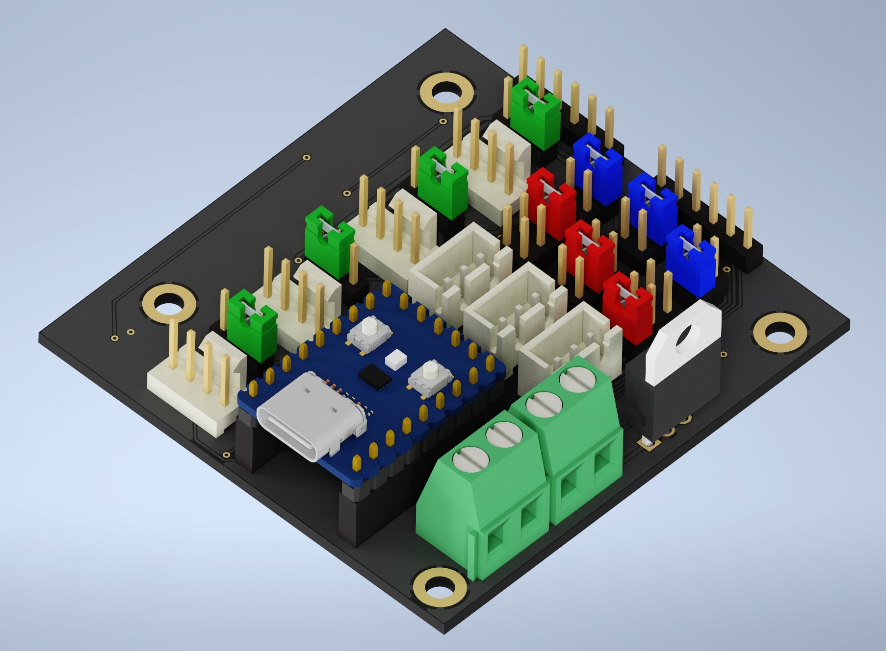

## TinyFan PCB Sources:
- KiCad Folder: Sources
- ProductionFiles Folder: Gerber, PNP & BOM for ordering.

## BOM:
|Reference                           |Quantity|Value              |LCSC    |Ali|
|------------------------------------|--------|-------------------|--------|-----|
|5VIN1 24VIN1                        |2       |Conn_01x02         |C475092 |[Link](https://s.click.aliexpress.com/e/_DC1TC2L)|
|AUX1 AUX2 AUX3                      |3       |Conn_01x03         |C144394 |[Link](https://s.click.aliexpress.com/e/_DEyuBIn)|
|AUX1PWR1 AUX2PWR1 AUX3PWR1          |3       |Conn_02x03_Odd_Even|C492420 |[Link](https://s.click.aliexpress.com/e/_DDO0FkL)|
|C1 C2                               |2       |10pF               |C107172 |[Link](https://s.click.aliexpress.com/e/_DkweKyn)|
|FAN1 FAN2 FAN3 FAN4                 |4       |Conn_01x04         |C402778 |   |
|FAN1PWR1 FAN2PWR1 FAN3PWR1 FAN4PWR1 |4       |Conn_01x03         |C2937625|[Link](https://s.click.aliexpress.com/e/_DDO0FkL)|
|J1 J2 J3                            |3       |Conn_02x02_Odd_Even|C706892 |[Link](https://s.click.aliexpress.com/e/_DDO0FkL)|
|J4 J5                               |2       |Conn_01x06_Male    |C492405 |[Link](https://s.click.aliexpress.com/e/_DDO0FkL)|
|Q1 Q2 Q3 Q4                         |4       |BSS138             |C52895  |[Link](https://s.click.aliexpress.com/e/_DF4Oc0f)|
|Q8 Q9 Q10                           |3       |wsf3085            |C148428 |[Link](https://s.click.aliexpress.com/e/_DlBoAQT)|
|R1 R2 R3 R4 R5 R6 R7 R8 R15 R16 R17 |11      |10K                |C144471 |[Link](https://s.click.aliexpress.com/e/_Ddns0gR)|
|U1                                  |1       |L7812              |C105651 |[Link](https://s.click.aliexpress.com/e/_DdftV8F)|
|RP2040 9Pin Female Headers          |2       |9                  |C39576  |[Link](https://s.click.aliexpress.com/e/_DdUyVnt)|
|RP2040 5Pin Female Headers          |1       |5                  |C50950  |[Link](https://s.click.aliexpress.com/e/_DFuppTv)|

Additional a [RP2040-Zero](https://s.click.aliexpress.com/e/_DFCoOxH)

**Assembly**
- Order the pcb at e.g. [pcbway](https://www.pcbway.com/project/shareproject/Voron_TinyFan_Adapter_1928b94a.html) or [jlcpcb](https://jlcpcb.com/)
- Order the parts at e.g. [lcsc](https://www.lcsc.com/)

**ATTENTION** 
The LDO is flipped in the image, please don't mount it with the fin outward the pcb 
it must be mounted inward, so 180° flipped to shown in the image
- 

## Notes
- This readme file contains Amazon Associate, Aliexpress affiliate, PCBWay affiliate links. I make a comission on qualifying purchases.
