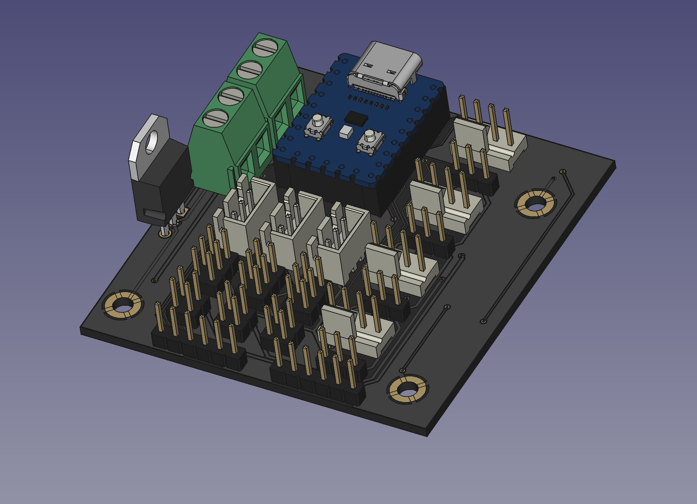
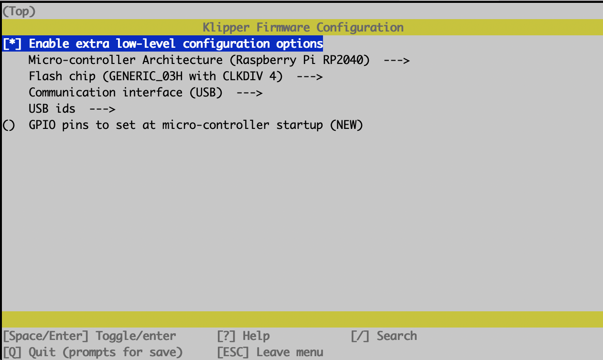
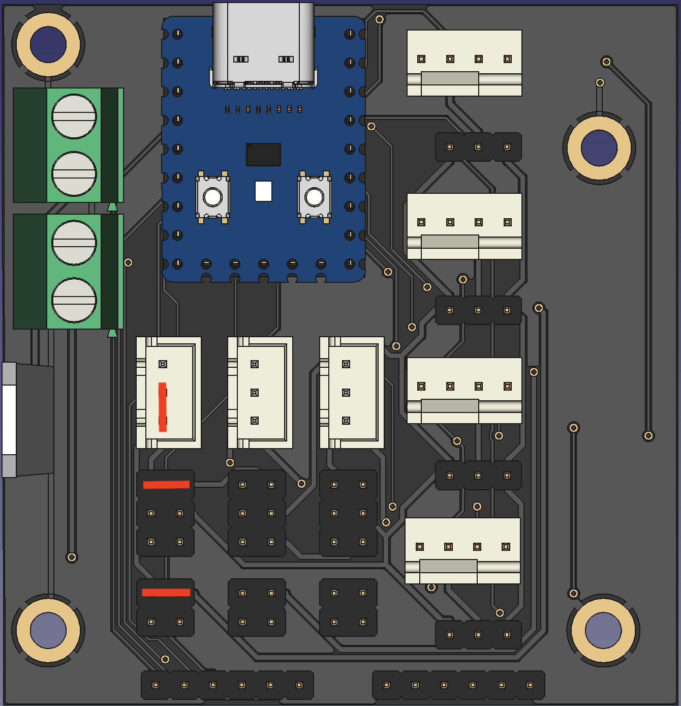
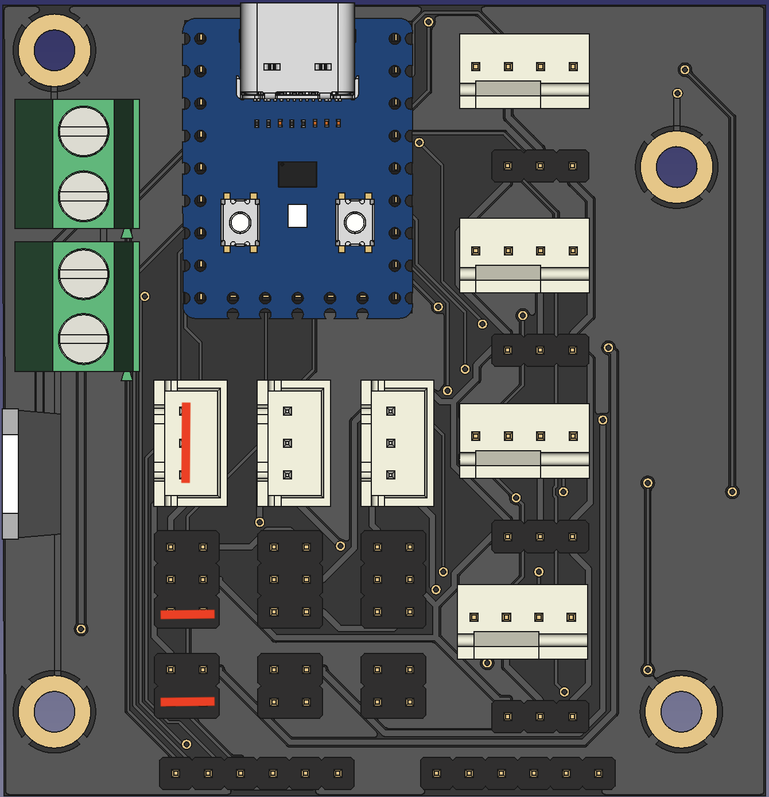

**Klipper TinyFan**

**BOM**
|Reference                           |Quantity|Value              |LCSC    |
|------------------------------------|--------|-------------------|--------|
|5VIN1 24VIN1                        |2       |Conn_01x02         |C475092 |
|AUX1 AUX2 AUX3                      |3       |Conn_01x03         |C144394 |
|AUX1PWR1 AUX2PWR1 AUX3PWR1          |3       |Conn_02x03_Odd_Even|C492420 |
|C1 C2                               |2       |10pF               |C107172 |
|FAN1 FAN2 FAN3 FAN4                 |4       |Conn_01x04         |C402778 |
|FAN1PWR1 FAN2PWR1 FAN3PWR1 FAN4PWR1 |4       |Conn_01x03         |C2937625|
|J1 J2 J3                            |3       |Conn_02x02_Odd_Even|C706892 |
|J4 J5                               |2       |Conn_01x06_Male    |C962326 |
|Q1 Q2 Q3 Q4                         |4       |BSS138             |C52895  |
|Q8 Q9 Q10                           |3       |wsf3085            |C148428 |
|R1 R2 R3 R4 R5 R6 R7 R8 R15 R16 R17 |11      |10K                |C144471 |
|U1                                  |1       |L7812              |C105651 |
|RP2040 9Pin Female Headers          |2       |9                  |C39576  |
|RP2040 5Pin Female Headers          |1       |5                  |C50950  |

Additional a [RP2040-Zero](https://s.click.aliexpress.com/e/_DFCoOxH)

**Assembly**
- Order the pcb at e.g. [pcbway](https://www.pcbway.com/project/shareproject/Voron_TinyFan_Adapter_1928b94a.html) or [jlcpcb](https://jlcpcb.com/)
- Order the parts at e.g. [lcsc](https://www.lcsc.com/)

- 

**Software setup**

- ssh into your raspberry pi
- run `ls /dev` and keep the list open
- Connect the rp2040 to your raspberry while holding down the boot button
- run again `ls /dev` and look out for the added device, usually this is sda1
- chroot into your klipper directory `cd klipper`
- cleanup all previous build files `make clean`
- create a new build config `make menuconfig`
- using the following settings
- 
- run the build `make`
- copy the firmware onto the rp2040
```
sudo mount /dev/sda1 /mnt
sudo cp out/klipper.uf2 /mnt
sudo umount /mnt
```
- find your mcu address by running `ls /dev/serial/by-id/*`
- add the new mcu to your printer.cfg
```
[mcu fans]
serial: /dev/serial/by-id/usb-Klipper_rp2040_XXXX
```


**Outputs**
<details>
  <summary>
    Fan1, Fan2, Fan3 and Fan3 are PWM Fans with RPM Output and selectable Voltage for 12 and 24V
  </summary>

```
[fan_generic rp2040_fan1]
pin: fans:gpio0
tachometer_pin: ^fans:gpio7
hardware_pwm: true
cycle_time: 0.00004

[fan_generic rp2040_fan2]
pin: fans:gpio1
tachometer_pin: ^fans:gpio8
hardware_pwm: true
cycle_time: 0.00004

[fan_generic rp2040_fan2]
pin: fans:gpio2
tachometer_pin: ^fans:gpio9
hardware_pwm: true
cycle_time: 0.00004

[fan_generic rp2040_fan3]
pin: fans:gpio3
tachometer_pin: ^fans:gpio10
hardware_pwm: true
cycle_time: 0.00004
```
</details>
    - Be aware that the 12V rail is only capable of a max of 1.5A

- Aux1, Aux2 and Aux3 are more versatile
<details>
    <summary>Adding more Thermistors</summary>


```
[temperature_sensor aux1]
sensor_type: NTC 100K beta 3950
sensor_pin: fans:gpio26
```
</details>

<details>
    <summary>Driving more 5V, 12V and 24V Fans</summary>



Be aware that the 12V rail is only capable of a max of 1.5A

```
[fan_generic rp2040_aux1]
pin: fans:gpio4
hardware_pwm: true
cycle_time: 0.00004

[fan_generic rp2040_aux2]
pin: fans:gpio5
hardware_pwm: true
cycle_time: 0.00004

[fan_generic rp2040_aux2]
pin: fans:gpio6
hardware_pwm: true
cycle_time: 0.00004
```
</details>

<details>
    <summary>Driving 5V and 24V Leds</summary>


```
[output_pin aux1_light]
pin: fans:gpio4
pwm:true
shutdown_value: 0
value:0
cycle_time: 0.01

[output_pin aux2_light]
pin: fans:gpio5
pwm:true
shutdown_value: 0
value:0
cycle_time: 0.01

[output_pin aux3_light]
pin: fans:gpio6
pwm:true
shutdown_value: 0
value:0
cycle_time: 0.01


```
</details>

<details>
    <summary>Driving Neopixels</summary>



```
[neopixel fan_neopixels]
pin: fans:gpio26
chain_count: 18
```
</details>

## Notes
- Many thanks to [Rama](https://github.com/Ramalama2) who came up with the initial idea and supported my a lot
- You can contact me via Discord "Gi7mo!#4618"
- This readme file contains Amazon Associate, Aliexpress affiliate, PCBWay affiliate links. I make a comission on qualifying purchases.
- This project does not come with any warranty, if you choose to build/use one, you are doing this at your own risk!