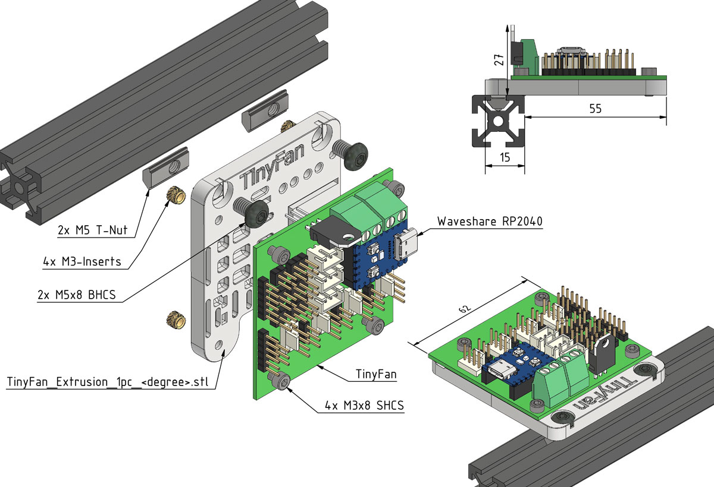
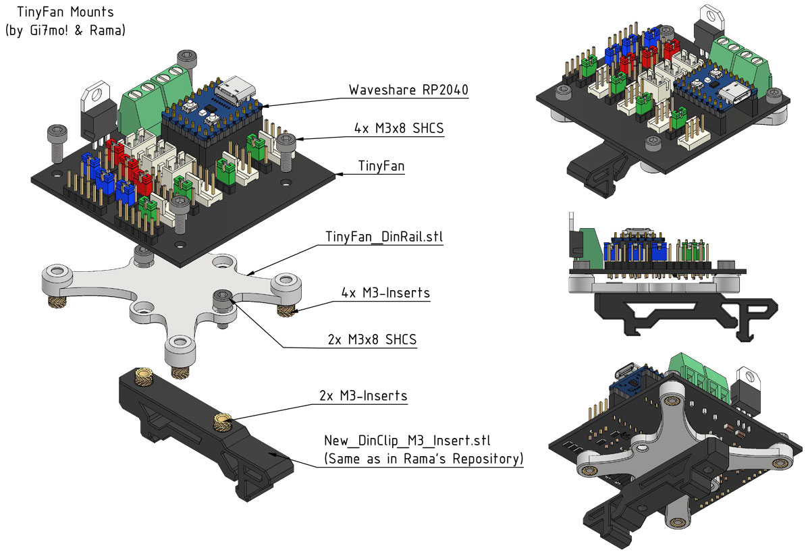

## Extrusion Mount:
- Folderstructure: Extrusion_DEGREE
- You can decide in which rotation you want to mount your TinyFan to the Extrusion!
- Every Folder contains a "TinyFan_Extrusion_1pc_DEGREE.stl" this one is a One Piece Version.
- Additionally there is always an Alternative Version (2 Parts) that is easier to Print! "TinyFan_Extrusion_2pc_DEGREE_A.stl" + "TinyFan_Extrusion_2pc_B.stl"
- Just as orientation Point, you will probably select the 90 degree One Piece Version.

## DIN Rail Mount:
- Consists of "TinyFan_DinRail.stl" and "New_DinClip_M3_Insert.stl"
- This one is self explanatory. See Pictures below.

## Print Settings:
- Default Voron settings, correct orientation, no supports needed!

## BOM:

